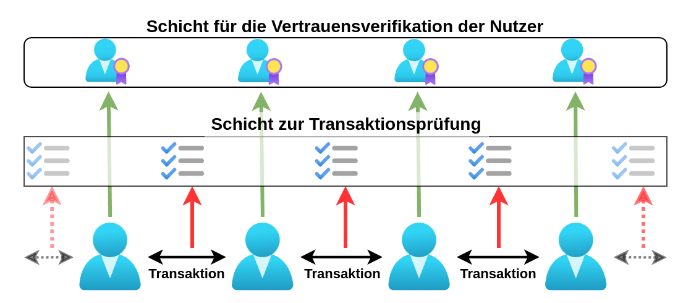

\begin{center}
\vspace{1cm}
\textbf{Unterstützer \& Ideengeber} \\
Alexander Mok, David, Johannes Bächlein, Udo Felix Wierlemann \\[0.5cm]

\textbf{Lizenz:} \\  
Creative Commons CC0 – Kein Urheberrecht (Public Domain) \\[0.5cm]

\textbf{Veröffentlichung:} \\  
Open Access (frei zugängliche und kostenlose Veröffentlichung) \\[0.5cm]
Das Konzeptpapier ist auf GitHub verfügbar:  
\url{https://github.com/minutogit/decentralized-voucher-payment-system}
\end{center}

---

## Kurzdarstellung

Dieses Konzeptpapier stellt ein dezentrales, vertrauensbasiertes elektronisches Gutschein-Zahlungssystem vor, das ohne klassische global verteilte Blockchain auskommt und auf der Schöpfung von digitalen Gutscheinen basiert. Diese Gutscheine repräsentieren reale Werte wie Arbeitszeit, Rohstoffe oder bestehende Währungen und ermöglichen stabilen, spekulationsfreien Werttransfer. Im Gegensatz zu herkömmlichen Kryptowährungen basiert das System zusätzlich auf menschlichem Vertrauen und es bietet eine hohe Wertstabilität wodurch es echten Leistungsaustausch in den Vordergrund stellt.

Die digitalen Gutscheine werden dezentral erstellt und in Umlauf gebracht, wobei sie am besten in der Region des betreffenden Gutscheinschöpfers akzeptiert werden. Sie können flexibel an die Bedürfnisse von Gemeinschaften angepasst werden, etwa als regionale Währung, inflationsgeschützte Alternative oder zur Förderung lokaler Wirtschaftskreisläufe. Eine zusätzliche Sicherungsschicht mit optionalen Servern gewährleistet durch anonymen Abgleich von Transaktionsdaten den Schutz vor Betrug.

Das System fördert soziale Dynamik, nachhaltiges Verhalten und wirtschaftliche Stabilität durch Anreize für verantwortungsvolles Handeln und den Aufbau von Reputation. Es bietet einzigartige Eigenschaften wie spekulationsfreie Nutzung, minimale Transaktionskosten in vertrauten Netzwerken und die Möglichkeit, sowohl offline als auch online zu funktionieren. Insgesamt stellt das vorgestellte Konzept eine innovative Lösung für regionale und globale elektronische Zahlungssysteme dar und vereint menschliches Vertrauen, Transparenz und Flexibilität.

## Einführung
Klassische Kryptowährungen wie Bitcoin basieren auf einer begrenzten Menge an Zahlungseinheiten (Coins/Tokens), deren Wert sich allein durch Angebot und Nachfrage bildet. Da sie nicht direkt an reale Werte oder wirtschaftliche Leistungen gekoppelt sind, unterliegen sie oft starken Preisschwankungen. Diese Volatilität führt dazu, dass sie in der Praxis häufiger als Spekulationsobjekte statt als Zahlungsmittel für den Leistungsaustausch genutzt werden.

Für eine praktikable Währung, die wirtschaftliche Berechnungen ermöglicht und verlässlich für Zahlungen genutzt werden kann, ist jedoch Wertstabilität entscheidend. Das vorgestellte System adressiert dieses Problem, indem digitale Gutscheine erschaffen werden, die direkt an wertstabile Ressourcen wie Arbeitszeit, Rohstoffe oder bestehende Währungen gekoppelt sind. Da diese Werte kaum spekulative Gewinne ermöglichen, bleibt Spekulation unattraktiv, und die Gutscheine dienen als verlässliches Zahlungsmittel für reale Leistungen.

Die hier vorgestellte Idee entstand aus der Motivation, Minuto-Cash (ein dezentrales, bargeldähnliches Zahlungssystem [1][2]) in eine elektronische Variante zu überführen, die dem ursprünglichen Minuto-Cash-Konzept so nahe wie möglich kommt. Im Originalkonzept schöpfen Menschen durch Bürgen besicherte Gutscheine, die durch eine zeitlich definierte Arbeitsleistung des Gutscheinschöpfers gedeckt sind. 

Hier wird ein elektronisches Gutscheinsystem vorgestellt, das auf dieser Idee basiert und Menschen ermöglicht, dezentral Gutscheine zu schöpfen. Diese können im Prinzip durch beliebige Werte wie Arbeitsleistung, Gold, Silber oder Währungen gedeckt sein, je nachdem, was die Menschen als sinnvoll und nützlich erachten. Diese Gutscheine können ähnlich wie eine Banküberweisung mit einer Transaktion übertragen und als Zahlungsmittel genutzt werden.

Weiterhin werden Ideen und Ansätze vorgestellt, wie das System auch überregional genutzt werden kann. Es wird auf besondere Eigenschaften, Anwendungsfälle und Herausforderungen eingegangen, die ein solches System mit sich bringt.

Zu den Herausforderungen eines solchen dezentralen Zahlungssystems gehören die Sicherstellung von Vertrauen und Betrugsresistenz ohne zentrale Instanz, die Balance zwischen Transparenz und Datenschutz sowie die Skalierbarkeit für größere Netzwerke. Das Konzept adressiert diese Probleme mit einer Kombination aus sozialem Vertrauen, dezentraler Kontrolle und optionalen Sicherheitsmechanismen. Die Lösungen zu diesen Herausforderungen werden in den folgenden Abschnitten näher erläutert.

### Funktionsweise – Grundidee

Im Gegensatz zu herkömmlichen Kryptowährungen, die für Transaktionen ein globale verteiltes Transaktionsbuch wie eine Blockchain verwenden, basiert dieses System auf dezentralen Gutscheinen. Diese Gutscheine, die im Wesentlichen Textdateien sind, enthalten Informationen über den Schöpfer, den Wert, Garantien und weitere relevante Daten. Eine besondere Eigenschaft dieser Gutscheine ist eine verkettete Liste (eine Art Mini-Blockchain je Gutschein), die den rechtmäßigen Eigentümer dokumentiert und den Transaktionsverlauf speichert.
Anstatt anonymer oder pseudonymer Adressen wie bei vielen Kryptowährungen werden im Transaktionsverlauf **öffentlich bekannte Nutzer-IDs** der Teilnehmer festgehalten. Diese Transparenz ermöglicht es, jede Transaktion einer realen, vertrauenswürdigen Identität zuzuordnen. Gleichzeitig bleibt die Privatsphäre der Teilnehmer gegenüber der Öffentlichkeit gewahrt, da die Transaktionsdetails nur für die Beteiligten innerhalb der Transaktionskette zugänglich sind.

\begin{figure}[h]
    \centering
    \includegraphics[width=0.7\textwidth]{images/voucher transaction circle_de.drawio.png}
    \caption{Transaktionsverlauf einer Gutscheindatei über mehrere Nutzer}
\end{figure}

Bei jeder Transaktion wird die neue Eigentümerschaft durch den aktuellen Besitzer mittels digitaler Unterschrift in die Transaktionsliste der Gutscheindatei eingetragen. Diese aktualisierte Datei wird an den neuen Eigentümer übermittelt – entweder online (z.B. per E-Mail oder Messenger) oder offline (z.B. per Datenträger oder direkt von Smartphone zu Smartphone). Auf diese Weise bleibt der Eigentumsverlauf dezentral und nachvollziehbar, ohne ein globales Transaktionsbuch zu erfordern.

### Doppelausgaben-Problematik
Wie kann verhindert werden, dass ein Betrüger eine Transaktion aus einer Gutscheindatei entfernt und dieselbe Transaktion erneut tätigt?

Da das System bewusst ohne ein globales Transaktionsbuch (z.B. Blockchain) auskommt, wird diese Herausforderung auf innovative Weise gelöst: Jede Transaktion muss vom aktuellen Besitzer des Gutscheins mit einer digitalen Unterschrift bestätigt werden. Wenn ein Teilnehmer denselben Gutschein mehrfach ausgibt, lässt sich anhand der Unterschrift eindeutig nachweisen, wer den Betrug begangen hat.

Die Wahrscheinlichkeit, dass der Betrug erkannt wird, steigt mit der Zeit, da die relevanten Informationen durch jede weitere Transaktion im Netzwerk weiter verbreitet werden. Meist bilden sich geschlossene Transaktionspfade, da Gutscheine in der Nähe ihres Schöpfers die höchste Akzeptanz haben und schließlich bei ihm eingelöst werden. Spätestens bei der Einlösung wird ein doppelter Gutschein entlarvt.

\begin{figure}[h]
    \centering
    \includegraphics[width=0.7\textwidth]{images/voucher double_spending_de.drawio.png}
    \caption{Nachdem Transaktion 7 empfangen wurde, kann Transaktion 3 als Betrug erkannt werden und durch die Unterschrift ist der Betrüger auch bekannt.}
\end{figure}

Ein entscheidender Mechanismus des Systems ist die soziale Kontrolle. Betrug führt in der Regel zum **Ausschluss aus der Gemeinschaft**, was eine besonders hohe Strafe darstellt, da Teilnehmer nicht nur ihren guten Ruf, sondern auch den Zugang zu wichtigen Netzwerken verlieren. Dies macht Betrug zu einem äußerst riskanten und selbstschädigenden Verhalten und wird dadurch unattraktiv. Somit beruht diese Lösung nicht nur auf 'kalten' technischen Maßnahmen, sondern ergänzt diese durch eine 'warme', soziale und menschliche Komponente. Dadurch entstehen neue Dynamiken und Eigenschaften, die insbesondere die menschliche Kooperation und Verantwortung fördern.

In kleinen Gruppen, die auf gegenseitigem Vertrauen basieren, kann dieses System ohne größere Infrastruktur verwendet werden. Eine einfache Software, die Gutscheine erstellt, verwaltet und Doppelausgaben erkennt, reicht aus. Wie mit Betrugsfällen umgegangen wird, liegt in der Verantwortung der jeweiligen Gruppe und kann an die Bedürfnisse der Gemeinschaft anpasst werden.

### Schicht zur Transaktionsprüfung
Mit wachsender Teilnehmerzahl oder bei Menschen, die einander weniger vertrauen, will man sicherstellen, dass kein Betrug geschieht bzw. dass Betrug schneller oder sofort erkannt wird. Dazu eignen sich Server, die Informationen zur Erkennung von Doppelausgaben sammeln. Es reicht aus, nur anonyme Informationen wie Hashes zu sammeln, um doppelte Ausgaben zu erkennen. So bleibt die Privatsphäre der Nutzer gewahrt.

Diese Sicherungsschicht kann bei Bedarf - je nach Wunsch der Nutzer - auch verpflichtend gemacht werden. In solchen Fällen sollten alle Transaktionen anonym auf den Servern abgeglichen werden, um doppelte Ausgaben auszuschließen. Dadurch wäre es nicht mehr notwendig, den Nutzer-IDs auf der Transaktionsliste zu vertrauen. Es würde genügen, nur noch dem Gutscheinschöpfer zu vertrauen, dass er für die Einlösung seiner Gutscheine geradesteht.

### Schicht für die Vertrauensverifikation der Nutzer

Die Reputation einer Nutzer-ID wird mit der Zeit in einem solchen System immer wichtiger, da sie die Grundlage für die Vertrauenswürdigkeit von Transaktionen bildet.
In der Praxis, werden also dezentrale Systeme benötigt, welche die öffentlichen Schlüssel (IDs) der Teilnehmer sowie deren gegenseitige Signaturen verwalten. 

Teilnehmer können sich durch gegenseitiges Unterschreiben ihrer Nutzer-IDs Vertrauen aufbauen und ihr seriöses Verhalten im Netzwerk nachweisen. Eine positive Reputation wird dadurch zu einem wertvollen Gut, das es Teilnehmern ermöglicht, einfacher mit anderen zu interagieren. Mit der Zeit können IDs sogar so vertrauenswürdig werden, dass sie in überregionalen Netzwerken akzeptiert werden.

Darüber hinaus können sich auf einem freien Markt Mechanismen wie Versicherungen entwickeln, die Nutzer-IDs absichern. Eine solche Versicherung könnte im Betrugsfall haften und so zusätzliche Sicherheit für alle Beteiligten bieten. Versicherer hätten einen Anreiz, nur IDs mit solider Reputation abzusichern, was die Vertrauenswürdigkeit im Netzwerk weiter stärken würde. Diese Dynamik kann von selbst entstehen und das System noch attraktiver für größere Netzwerke und überregionale Anwendungen machen.

In kleinen Gruppen, in denen sich die Teilnehmer gut kennen, kann die Vertrauensverifikation direkt von der jeweiligen Software übernommen werden, ohne zusätzliche Serverinfrastruktur. Erst bei größerer Verbreitung werden Server notwendig. Server, die bereits Informationen für die Transaktionsprüfung zur Erkennung von Doppelausgaben bereitstellen, könnten z.B. diese Aufgabe mit übernehmen.

### Wechselwirkung der Sicherheitsschichten
Die beiden Sicherheitsschichten – Transaktionsprüfung und Vertrauensverifikation – stehen in einer dynamischen Wechselwirkung, die je nach Kontext flexibel kombiniert werden kann, um Sicherheit und Effizienz zu maximieren. Je höher das Vertrauen in die Teilnehmer eines Netzwerks ist, desto seltener müssen Transaktionen zeitnah serverbasiert geprüft werden, sondern die Software jedes Nutzers, die dezentral zeitverzögert Betrug erkennen und beweisen kann, ist zur Kontrolle ausreichend. In Gruppen mit etablierter Reputation können viele Transaktionen ohne sofortigen Abgleich erfolgen, was Kosten und Ressourcen spart. Bei globalen Zahlungen, wo das Vertrauen zwischen Teilnehmern oft weniger ausgeprägt ist, wird hingegen eine zeitnahe Prüfung durch Server häufiger notwendig sein. Gleichzeitig kann eine starke globale Reputation dazu führen, dass auch hier weniger Prüfungen erforderlich sind, was das System effizienter macht. Versicherungen könnten als Alternative zur sofortigen Prüfung dienen, indem sie im später entdeckten Betrugsfall haften und das Risiko für Teilnehmer übernehmen. Vermutlich wird sich eine Balance zwischen Echzeitprüfungen und Versicherungsmechanismen entwickeln, wobei die Kosten entscheiden, welche Variante in einem bestimmten Kontext günstiger ist.
Da das System keine zentrale Datenbank benötigt, bleibt es theoretisch hoch skalierbar. Jedoch könnten größere Netzwerke eine verstärkte Nutzung der optionalen Serverprüfung erfordern. Eine mögliche Lösung wäre eine verteilte Architektur, in der mehrere unabhängige Server operieren.

### Datenschutz
Die Einsicht in Transaktionen ist in diesem System an den Besitz der jeweiligen Gutscheine gebunden. Das bedeutet, dass man nur dann Zugriff auf die Transaktionshistorie eines Gutscheins hat, wenn man diesen Gutschein entweder selbst erhalten hat oder an einer Transaktion mit ihm beteiligt war. Für Außenstehende, die keinen Zugriff auf den Gutschein haben, bleiben die Transaktionen vollständig verborgen.

Daher sind Transaktionen in diesem System teilöffentlich. Nur bei Gutscheinen, auf die man direkten Zugriff hat, können die Transaktionen zwischen den jeweiligen Teilnehmern und die ausgetauschten Werte nachvollzogen werden. Die Daten des  Großteils der weltweit verwendeten Gutscheine bleibt für Außenstehende unzugänglich.

Bei Gutscheinen, auf die man Zugriff hat, ist ersichtlich, wann eine Transaktion stattgefunden hat und welche Teilnehmer daran beteiligt waren. Da jedoch jede Transaktion mehrere Gutscheine umfassen kann, bleibt auch der tatsächliche Gesamtbetrag der Transaktion für den Beobachter eines einzelnen Gutscheins unklar.

Zusätzlich können sensible Daten wie der Verwendungszweck oder weitere Details getrennt von den Transaktionsdaten der Gutscheine übermittelt werden. Dadurch bleiben diese Informationen privat und müssen nicht im Gutschein selbst gespeichert werden. Dies  gewährleistet Transparenz in den relevanten Bereichen und schützt gleichzeitig die Privatsphäre der Nutzer.

### Vermeidung zu vieler ungedeckter Gutscheine
Neben dem Schutz der Privatsphäre ist auch die Sicherstellung der Deckung von Gutscheinen ein zentraler Aspekt, um Vertrauen im System aufzubauen.
Um also das Problem zu vermeiden, dass Menschen übermäßig viele Gutscheine schöpfen, die sie vielleicht gar nicht einlösen können, gibt es eine einfache dezentrale Möglichkeit der Regulierung. Bei Minuto-Cash wird beispielsweise die Regel angewandt, dass für einen gültigen Gutschein zwei Bürgen erforderlich sind – ein männlicher und ein weiblicher. Diese Bürgen haften im Notfall für den Wert des Gutscheins, falls der Gutscheinschöpfer die zugesicherte Leistung nicht erbringen kann.

Da niemand leichtfertig für andere bürgt, insbesondere wenn die Möglichkeit besteht, dass man im Fall der Bürgschaft selbst Leistungen erbringen muss, wird die Schöpfung der Gutscheine automatisch auf ein sinnvolles Maß begrenzt. Bürgen haben ein natürliches Interesse daran, die Verpflichtungen zu minimieren, und werden daher nur für vertrauenswürdige Menschen bürgen, die ihre Verpflichtungen erfüllen können.

Dieser Mechanismus lässt sich auch digital einfach abbilden. Die Gutscheine können mit zusätzlichen digitalen Signaturen der Bürgen versehen werden, die ihre Verantwortung bestätigen. Im Falle einer Nichteinlösung müssen die Bürgen für den Gutschein einstehen und eine gleichwertige Leistung erbringen. Dieses Verfahren ermöglicht eine transparente und effiziente Regulierung der Gutscheinschöpfung in einem dezentralen System.

Ein weiterer wichtiger Aspekt zur Regulierung der Gutscheinschöpfung ist die begrenzte Gültigkeitsdauer der Gutscheine. Diese sorgt dafür, dass Gutscheine innerhalb eines bestimmten Zeitraums eingelöst werden und nicht unbegrenzt im Umlauf bleiben. Dadurch wird sichergestellt, dass der Schöpfer regelmäßig seinen Verpflichtungen nachkommt. Gleichzeitig verhindert dies, dass verloren gegangene oder nicht mehr auffindbare Gutscheine als offene Schulden des Schöpfers fortbestehen, obwohl sie realistisch nicht mehr eingefordert werden. So kann der Schöpfer stets einen klaren Überblick über seine tatsächlich noch ausstehenden Verpflichtungen behalten.

Letztendlich wird der Markt selbst regulieren, wie viele Gutscheine geschöpft werden und welchen davon Vertrauen entgegengebracht wird. Ebenso wird sich dynamisch zeigen, in welchen Fällen Bürgen notwendig sind und in welchen Netzwerken ein hohes Maß an Vertrauen bereits ausreicht, um Gutscheine auch ohne Bürgschaft zu akzeptieren. In einigen Fällen könnten weitere Mechanismen zur Absicherung entstehen, wie beispielsweise alternative Vertrauensnachweise oder Versicherungssysteme. Diese Flexibilität erlaubt es, dass sich das System je nach Anwendungsfall und Vertrauensniveau der Teilnehmer anpasst, sodass eine natürliche Balance zwischen Sicherheit, Vertrauen und praktischer Nutzung gewährleistet bleibt.

## Technische Umsetzung

In der Praxis ist ein Gutschein lediglich eine Textdatei. Für die genaue Umsetzung muss ein Standard definiert werden. Hier ist ein beispielhafter, grober Aufbau.

Der Gutschein hat einen Erzeuger, der durch die `creator_id` (seinen öffentlichen Schlüssel) eindeutig identifiziert wird. Die Datei enthält außerdem einen Zeitstempel, eine Beschreibung des Gutscheins, die Menge der Zahlungseinheiten und weitere Angaben, die in der Praxis ergänzt werden können. Die `voucher_id` wird aus dem Hash dieser Angaben berechnet (z.B. base58-codiert). Um sicherzustellen, dass der Gutschein tatsächlich vom Ersteller stammt, wird die `voucher_id` vom Ersteller digital signiert (`creator_signature`).

\begin{figure}[h]
    \centering
    \includegraphics[width=\textwidth, height=\textheight, keepaspectratio]{images/voucher transaction.png}
    \caption{Beispiel eines Gutscheins mit Transaktionen}
\end{figure}

Wird ein Gutschein an jemanden übertragen, werden Transaktionsdaten in der Gutschein-Datei angefügt. Jede Transaktion enthält einen `previous_hash`, der die Transaktionen miteinander verknüpft, und eine `transaction_id`, die sich aus dem Hash der gesamten Transaktionsdaten ergibt. Zu den Transaktionsdaten gehören beispielsweise der Sender, der Empfänger, ein Zeitstempel, der übertragene Betrag sowie gegebenenfalls weitere relevante Informationen.

Bei der ersten Transaktion wird der `previous_hash` aus dem Hash der `voucher_id` berechnet, bei den nachfolgenden Transaktionen aus dem Hash der `transaction_id` der vorherigen Transaktion. Jede Transaktion benötigt eine digitale Signatur des Senders, um die Integrität der Transaktionskette sicherzustellen.

Ein Gutschein kann zudem in Teilbeträge aufgeteilt werden, sodass präzise Beträge übertragen werden können. Wenn ein Sender nur einen Teilbetrag eines Gutscheins verschickt, bleibt der Gutschein beim Sender erhalten. Der Sender kann anschließend weitere Transaktionen an die letzte Teiltransaktion anhängen, solange das verbleibende Guthaben ausreicht. 

Doppeltausgaben lassen sich leicht erkennen, indem geprüft wird, ob es mehrere Transaktionen desselben Senders mit demselben `previous_hash` gibt. Durch die Signatur ist dabei auch eindeutig nachweisbar, von wem die doppelte Ausgabe stammt. In der Praxis müssen in der Software auch Gutscheine ohne Guthaben über die Zeit der Gültigkeit vorgehalten werden, um später Doppeltausgaben erkennen zu können.

\begin{figure}[h]
    \centering
    \includegraphics[width=0.65\textwidth, height=\textheight, keepaspectratio]{images/voucher additional signature.png}
    \caption{Beispiel einer zusätzlichen Signatur}
\end{figure}

Zusätzliche Signaturen können einfach in die Gutschein-Datei integriert werden. Beispielsweise könnten Bürgen nach der Erstellung des Gutscheins die `voucher_id` mit zusätzlichen Informationen unterschreiben, um ihre Bereitschaft zur Haftung bei einem möglichen Ausfall des Gutscheins zu bestätigen.

Zusätzlich ist es sinnvoll, ein Public-Key-Verfahren zu integrieren, das einen Diffie-Hellman-Schlüsselaustausch ermöglicht. Dadurch können die Transaktionsdateien beim Versenden verschlüsselt werden, sodass nur der vorgesehene Empfänger sie entschlüsseln kann. Dieses Verfahren gewährleistet, dass der Inhalt der Transaktion selbst bei der Übermittlung über unsichere Kanäle wie E-Mail oder Messenger vor unbefugtem Zugriff geschützt bleibt.

## Eigenschaften und Auswirkungen des Systems

Das System bietet zahlreiche Eigenschaften, die es deutlich von herkömmlichen Zahlungsmitteln und Kryptowährungen unterscheiden und es zu einer innovativen Alternative machen.

- **Keine Spekulationsanreize**: Da Gutscheine einen festen Wert haben und direkt mit Leistungen oder Vermögenswerten gedeckt sind, wird Spekulation effektiv vermieden.
- **Fokus auf echten Leistungsaustausch**: Das System ist primär für den Wertschöpfungsaustausch zwischen Teilnehmern ausgelegt und fördert somit echte wirtschaftliche Aktivitäten.
- **Wachsendes Vertrauen durch Netzwerkeffekte**: Je größer das Netzwerk wird, desto höher ist der Anreiz, sich vertrauenswürdig und kooperativ zu verhalten, da positive Interaktionen die Reputation stärken und den Zugang zu weiteren Netzwerken und besseren Möglichkeiten fördern. Vertrauensbrüche hingegen werden durch die Gemeinschaft sanktioniert.
- **Vertrauen als Sicherheitsgrundlage**: Das System basiert auf einer menschlichen Sicherheitsschicht, die durch gegenseitiges Vertrauen gestärkt wird.
- **Geringe Anreize für Betrug und Diebstahl**: Die Struktur des Systems minimiert die Motivation für illegale Aktivitäten, da Transaktionen transparent sind und eindeutig auf die Identitäten der Teilnehmer zurückgeführt werden können.
- **Förderung sozialen Verhaltens**: Teilnehmer werden durch das System motiviert, sich sozial und verantwortungsvoll zu verhalten, da ihre Reputation direkten Einfluss auf ihre Kosten und Möglichkeiten hat.
- **Keine Transaktionskosten in vertrauenswürdigen Netzwerken**: In vertrauten Bereichen, in denen IDs als vertrauenswürdig gelten, sind keine zusätzlichen Serverüberprüfungen nötig, da selbst die Client-Software mit der Zeit Betrug erkennen kann.
- **Offline-Funktionalität**: Das System unterstützt auch Offline-Transaktionen, was es besonders attraktiv für Regionen ohne stabile Internetverbindung macht und unbegrenzte gleichzeitige Transaktionen ermöglicht, da keine globale Blockchain erforderlich ist.
- **Ideal für private Netzwerke**: Organisationen, Initiativen oder Gemeinschaften, die vertrauliche, interne Strukturen wahren wollen, haben hier eine geeignete Lösung. Jede Gruppe agiert wie ein unabhängiger Mikrokosmos, ohne Spuren in globalen Systemen zu hinterlassen. Dies garantiert den Teilnehmern maximale Privatsphäre und vollständige Autonomie.

## Vergleich mit Blockchain-basierten Kryptowährungen
Da es sich um ein digitales Zahlungsmittel handelt, lohnt sich ein Vergleich mit bekannten Blockchain-basierten Kryptowährungen. Das hier vorgestellte System unterscheidet sich in seinen Eigenschaften grundlegend und bietet teils bemerkenswerte Vorteile, die unter anderem auf der sozialen Komponente basieren.

### Besondere Eigenschaften im Vergleich zu Kryptowährungen

#### Frei und dezentral erschaffbares Zahlungsmittel
Während die Coins oder Token bei Kryptowährungen entweder kostenintensiv mit Energieaufwand geschürft (Mining) oder mit Geld gekauft werden müssen, können Gutscheine beim Gutschein-System von jedem Menschen frei geschaffen werden, ohne technische oder finanzielle Hürden. Dadurch steht das Zahlungsmittel sofort zur Verfügung und trägt direkt zur Wertschöpfung und zum Leistungsaustausch bei.
    
#### Keine Abhängigkeit von Knappheit
Viele Kryptowährungen wie Bitcoin basieren auf künstlicher Knappheit, die durch technische Begrenzungen wie maximale Token-Anzahl entsteht, was zu ungleicher Verteilung führen kann. Vermögende Akteure können große Mengen anhäufen, während ärmeren Menschen der Zugang zu einem notwendigen Zahlungsmittel verwehrt bleibt. Das Gutschein-System vermeidet diese Problematik, da der Wert direkt an reale Leistungen oder Ressourcen gekoppelt ist und bei Bedarf geschöpft werden kann.
    
#### Regionalgeldcharakter
Durch die dezentrale Natur des Systems bleiben die Gutscheine oft im Umkreis des Schöpfers. Dies fördert regionale Wirtschaftskreisläufe, stärkt lokale Unternehmen und bietet einen direkten Nutzen für die Gemeinschaft. Gleichzeitig ermöglicht das System bei entsprechend aufgebauter globaler Reputation eine flexible Nutzung über regionale Grenzen hinaus. Kryptowährungen hingegen haben oftmals keinen lokalen Bezug und fließen oft in globale Spekulationsmärkte ab.
    
#### Soziale Kontrolle statt technischer Konsensmechanismen 
Das Gutschein-System nutzt soziale Dynamiken, Reputation und Vertrauensnetzwerke zur Sicherung der Transaktionen. Diese Mechanismen fördern direkte Verantwortung und reduzieren die Abhängigkeit von technischen Prüfungen. Kryptowährungen hingegen verlassen sich auf energieintensive technische Konsensmechanismen wie Proof-of-Work oder Proof-of-Stake, die unabhängig von sozialem Verhalten agieren.

#### Frei von Spekulation
Im Gegensatz zu Kryptowährungen, deren Werte oft starken Schwankungen unterliegen, sind die Gutscheine des Systems spekulationsfrei. Sie repräsentieren reale Werte wie Arbeitsleistung oder Rohstoffe, was sie stabil und berechenbar macht.

### Tabelle - Vergleich zu Kryptowährungen

Um die Unterschiede zwischen dem Gutschein-System und Blockchain-basierten Kryptowährungen noch klarer darzustellen, zeigt die folgende Tabelle einen direkten Vergleich einiger Merkmale.

\begin{longtable}{|>{\raggedright\arraybackslash}p{4cm}|>{\raggedright\arraybackslash}p{5.7cm}|>{\raggedright\arraybackslash}p{5.7cm}|}
\hline
\rowcolor[gray]{0.9} \textbf{Merkmal} & \textbf{Gutschein-System} & \textbf{Blockchain-System} \\
\hline
\renewcommand{\arraystretch}{1.5}
Organisationsform & Dezentral, ohne globales Transaktionsbuch. & Dezentral, aber auf ein globales, verteiltes Transaktionsbuch (Blockchain) angewiesen. \\
\hline
Skalierbarkeit & Hohe Skalierbarkeit, da Transaktionen lokal überprüft und gespeichert werden können. & Begrenzte Skalierbarkeit, da alle Transaktionen global im globalen Transaktionsbuch gespeichert werden müssen. \\
\hline
Energieverbrauch & Minimal, da keine Konsensmechanismen wie Proof-of-Work notwendig sind. & Hoch, insbesondere bei Mining-basierten Blockchains wie Bitcoin. \\
\hline
Transaktionsdauer & Kurz, da keine globale Validierung erforderlich ist. & Teilweise lang, besonders bei stark genutzten Netzwerken (z.B. Bitcoin, Ethereum). \\
\hline
Nutzerseitige Transaktionskosten & Niedrig bis kostenlos in vertrauensbasierten Netzwerken. & Variabel, oft hoch aufgrund von Netzwerkgebühren (z.B. Gas Fees bei Ethereum). \\
\hline
Offline-Funktionalität & Unterstützt, da Transaktionen lokal oder offline gespeichert und übertragen werden können. & Nicht möglich, da eine Verbindung zur Blockchain erforderlich ist. \\
\hline
Doppelausgaben-Schutz / Betrug & Durch digitale Signaturen und soziale Kontrolle. Betrug ist nachweisbar und führt zu Reputationsverlust. & Durch Konsensmechanismen (z.B. Proof-of-Work, Proof-of-Stake). \\
\hline
Motivation für Hacking/Diebstahl & Gering: Identitätsbindung und soziale Kontrolle minimieren Anreize. & Hoch: Große Vermögenswerte und Pseudonymität ziehen Hacker an. \\
\hline
Missbrauch für illegale Transaktionen & Gering: Soziale Kontrolle und teil-öffentliche Transaktionen erschweren illegalen Einsatz. & Hoch: Anonymität und globale Reichweite fördern den Einsatz in illegalen Märkten (z.B. im Darknet). \\
\hline
Datenschutz & Teil-öffentlich: Nur der direkte Zugriff auf Gutscheine zeigt Details zu Transaktionen. & Pseudonym, aber alle Transaktionen sind öffentlich einsehbar (z.B. Bitcoin-Blockchain). \\
\hline
Anonymität & Anonymisiert durch Hashes und teilöffentliche Transaktionen. & Pseudonymisiert, jedoch können Adressen oft zurückverfolgt werden. \\
\hline
Flexibilität der Deckung & Gutscheine können mit Arbeitszeit, Rohstoffen, Währungen oder anderen Werten gedeckt sein. & Coins/Token basieren meist auf Knappheit oder spekulativen Marktmechanismen. \\
\hline
Spekulation & Spekulationsfrei, da der Wert an reale Leistungen oder Werte gebunden ist. & Hohe Spekulationsanfälligkeit, da der Wert oft nur von Angebot und Nachfrage bestimmt wird. \\
\hline
Reputation und Vertrauen & Vertrauen basiert auf sozialer Kontrolle, Reputationsmechanismen und optionalen Bürgen. & Kein direktes Vertrauen erforderlich, da die Sicherheit durch Konsensmechanismen gewährleistet wird. \\
\hline
Einsatzgebiete & Regionalwährungen, Zeitbanken, rohstoffgedeckte Währungen, lokale Gemeinschaften. Bei entwickelten Reputationssystemen auch überregional. & Globaler Einsatz, hauptsächlich für Handel, Spekulation und digitale Vermögenswerte. \\
\hline
\end{longtable}

## Anwendungsbeispiele

Das System bietet die Flexibilität, nahezu jede Währung oder Ressource parallel abzubilden und in verschiedensten Szenarien eingesetzt zu werden. Es ermöglicht sowohl die Nutzung als lokale Regionalwährung als auch die Abwicklung globaler Transaktionen oder die Unterstützung nachhaltiger Programme. Dabei können unterschiedlichste Werte wie Arbeitszeit, Rohstoffe, Dienstleistungen oder traditionelle Währungen gleichzeitig integriert werden. Die folgenden Beispiele zeigen die Vielseitigkeit und Anpassungsfähigkeit des Gutschein-Systems in einer Vielzahl von Anwendungsbereichen.

### Regionalwährungen auf Basis nationaler Währungen
Lokale und regionale Gruppen könnten Gutscheine ausstellen, die direkt mit der eigenen Landeswährung (z.B. Euro oder Dollar) gedeckt sind. Die Teilnehmer hinterlegen Geld und geben Gutscheine im gleichen Wert aus, die in der Region zirkulieren. Dies hält das Geld lokal, stärkt die regionale Wirtschaft und fördert den Austausch innerhalb der Gemeinschaft.

### Wertbeständige Gutscheine durch Edelmetall
In Zeiten wirtschaftlicher Instabilität könnten Menschen mit wertbeständigen Gütern wie Silber Gutscheine ausstellen, die durch Silberunzen gedeckt sind. Diese bieten eine inflationsgeschützte Alternative zu instabilen Währungen und ermöglichen Transaktionen in flexiblen Beträgen, ohne auf physische Silberunzen zurückgreifen zu müssen.

### Zeitbanken und Tauschbörsen
Gutscheine könnten Arbeitsstunden repräsentieren und in Zeitbanken oder lokalen Tauschbörsen genutzt werden. Dies fördert den Austausch von Dienstleistungen, stärkt soziale Netzwerke und unterstützt lokale Gemeinschaften beim Aufbau gegenseitigen Vertrauens.

### Gemeinschaftsprojekte und Crowdfunding
Gutscheine könnten zur Finanzierung von Gemeinschaftsprojekten oder Crowdfunding-Kampagnen eingesetzt werden. Teilnehmer erhalten im Gegenzug Gutscheine, die sie später für die Nutzung oder Erträge der Projekte einlösen können, was die Gemeinschaft fördert und Projekte finanzierbar macht.

### Rohstoff- und Energiehandel
Gutscheine könnten als Einheiten von Energie (z.B. kWh) oder Rohstoffen (z.B. Getreide, Wasser) genutzt werden. Dies ermöglicht einen einfacheren Handel und eine bessere Planbarkeit in entsprechenden Märkten, insbesondere bei nachhaltigen Ressourcen.

### Veranstaltungsbasierte Währungen
Für Festivals, Messen oder Veranstaltungen könnten temporäre Gutscheinsysteme eingeführt werden. Diese vereinfachen den Handel vor Ort, schützen die Privatsphäre der Teilnehmer und schaffen ein geschlossenes wirtschaftliches Ökosystem.

### Bildungs- und Weiterbildungsgutscheine
Institutionen könnten Gutscheine für den Zugang zu Kursen, Seminaren oder anderen Bildungsangeboten ausgeben. Dies erleichtert den Zugang zu Bildung, schafft Anreize für Weiterbildung und erhöht die Reichweite solcher Programme.

### Krisenhilfe und humanitäre Einsätze
In Krisengebieten könnten Gutscheine als alternatives Zahlungsmittel eingeführt werden, um Handel und Austausch zu fördern. Auch ohne funktionierende offizielle Währungen können so lokale Ressourcen mobilisiert und Gemeinschaften unterstützt werden.

### Unternehmensinterne Systeme
Firmen könnten Gutscheine für Mitarbeitervorteile oder interne Dienstleistungen zwischen Abteilungen verwenden. Dies vereinfacht interne Prozesse, motiviert die Mitarbeiter und schafft eine klare Struktur für Belohnungen oder Ressourcenaustausch.

### Recycling- und Nachhaltigkeitsprogramme
Gutscheine könnten für die Rückgabe von recycelbaren Materialien ausgegeben und für nachhaltige Produkte oder Dienstleistungen eingelöst werden. Dies fördert Recycling, reduziert Abfall und schafft zusätzliche Anreize für umweltfreundliches Verhalten.

### Stadtentwicklung und Infrastruktur
Städte könnten Gutscheine nutzen, um Bürger für ehrenamtliche Arbeit oder die Unterstützung bei Infrastrukturprojekten zu belohnen. Diese Gutscheine könnten lokal eingelöst werden und zur Verbesserung der Lebensqualität beitragen.

### Digitale Nomaden und Freelancer
Globale Netzwerke könnten Gutscheine für Zahlungen in grenzübergreifenden Arbeitsbeziehungen einsetzen. Dies bietet digitale Sicherheit, fördert den Austausch zwischen Kulturen und erleichtert die Bezahlung in global vernetzten Gemeinschaften.

## Perspektiven für die Weiterentwicklung und Etablierung

Das vorgestellte System ist vollständig dezentral und bietet den Nutzern die Möglichkeit, sich eigenständig zu organisieren und Lösungen für aufkommende Fragen zu entwickeln. Steuerrechtliche oder andere rechtliche Fragen, die für einzelne Nutzer relevant sein könnten, müssen von diesen selbstständig geklärt werden. In kleinen, privaten Anwendungen sind solche Aspekte jedoch häufig weniger kritisch und Lösungen können dort frei erprobt werden.

Bei einer starken globalen Nutzung könnte sich ein Bedarf an weiterentwickelten Sicherungsschichten ergeben, insbesondere um Transaktionen effizient und dezentral überprüfbar zu machen. Hier könnten sich Mechanismen entwickeln, die Doppelausgaben schnell erkennen, ohne die Privatsphäre der Nutzer zu beeinträchtigen. Ähnlich gilt dies für die Vertrauenswürdigkeit von Nutzer-IDs: Es bleibt offen, wie Vertrauen in globalen Netzwerken aufgebaut und Betrugsfälle gehandhabt werden. Diese Dynamiken dürfen sich organisch entwickeln und passen sich den Bedürfnissen der Nutzer an.

Die Interoperabilität mit bestehenden Zahlungssystemen und anderen Technologien wird sich ebenfalls durch den Bedarf der Nutzer entwickeln. Sobald ein Wunsch nach Verknüpfungen mit etablierten Systemen wie Banken oder Kryptowährungen entsteht, können hybride Ansätze entstehen, welche die Vorteile verschiedener Systeme kombinieren.

Testszenarien für die praktische Anwendung des Systems können jederzeit von den Nutzern selbst in kleinen, privaten Umfeldern durchgeführt werden, sofern passende Software und Apps verfügbar sind. Dies ermöglicht es, das System Schritt für Schritt zu erproben, Schwächen zu identifizieren und Lösungen in einer geschützten Umgebung zu entwickeln. Eine erste Umsetzung dieses Konzepts existiert bereits in Form eines Prototyps für Desktop-Computer unter dem Namen eMinuto [3][4], welcher die Funktionsweise des Gutschein-Systems demonstriert.

Auch die Standardisierung der Gutscheinformate und anderer technischer Details wird ein natürlicher Prozess sein, der sich mit der Zeit etabliert. In einem dezentralen Umfeld werden sich Standards durch den Konsens der Nutzer und die Praxistauglichkeit von Lösungen herausbilden. Dies erlaubt eine flexible und anpassungsfähige Entwicklung, die von den Bedürfnissen und Innovationen der Nutzer getrieben wird.

Letztlich wird die Zukunft des Systems von den Nutzern bestimmt. Sie entscheiden, wie das System genutzt wird, welche Mechanismen sich etablieren und wie groß der globale Einfluss sein wird. Dezentralisierte Zahlungssysteme können Gesellschaften widerstandsfähiger gegenüber Krisen machen und insbesondere dort Wohlstand fördern, wo zentralisierte Systeme aufgrund fehlender Kreditwürdigkeit oder anderer Hürden bisher scheiterten. Dieses Potenzial macht die vorgestellte Lösung zu einer vielversprechenden Grundlage für eine gerechtere, nachhaltigere und robustere globale Wirtschaft.

## Zusammenfassung

Das vorgestellte dezentrale Gutschein-Zahlungssystem vereint einzigartige Eigenschaften, die das Potenzial haben, eine innovative Alternative zu herkömmlichen Zahlungsmitteln und Blockchain-basierten Kryptowährungen zu bieten. Es ermöglicht die Abbildung realer Werte wie Arbeitszeit, Rohstoffe oder bestehender Währungen und schafft eine Grundlage für stabilen, spekulationsfreien Werttransfer. Der Fokus auf soziale Dynamik, Reputation und Vertrauen hebt das System besonders hervor, da es ohne energieintensive technische Konsensmechanismen auskommt.

Das System fördert nachhaltige Wirtschaftskreisläufe, indem es lokale und regionale Gemeinschaften stärkt, gleichzeitig aber auch überregional nutzbar ist, sobald globale Reputationsmechanismen entwickelt werden. Die flexible Einbindung von Ressourcen ermöglicht vielseitige Anwendungsfälle, von Regionalwährungen über Bildungs- und Crowdfunding-Projekte bis hin zu Recyclingprogrammen.

Ein besonderer Vorteil ist die Möglichkeit, Teilbeträge von Gutscheinen präzise zu übertragen und Transaktionen offline abzuwickeln, was es auch für Regionen mit schwacher Infrastruktur attraktiv macht. Mit zunehmender Verbreitung könnten Mechanismen zur globalen Vertrauensbildung, wie Versicherungen oder standardisierte Reputationssysteme, entstehen, die den Einsatz auf internationaler Ebene erleichtern.

Die nächsten Schritte umfassen die Entwicklung eines einheitlichen Datenformats (Standards) für Gutscheine, um die Kompatibilität zwischen verschiedenen Programmen zu gewährleisten und den Austausch zwischen Netzwerken zu erleichtern. Ebenso wichtig ist die Bereitstellung benutzerfreundlicher Software, die den Zugang und die Anwendung des Systems intuitiv und effizient gestaltet. Insgesamt stellt das System eine zukunftsfähige, nachhaltige Lösung dar, die Vertrauen, Flexibilität und Sicherheit in elektronischen Zahlungssystemen neu definiert.

### Referenzen 
[1] \url{https://minutocash.org}  
[2] \url{https://www.minuto.wiki}  
[3] \url{https://eminuto.org}  
[4] \url{https://github.com/minutogit/MinutoCashDigitalPrototype}
