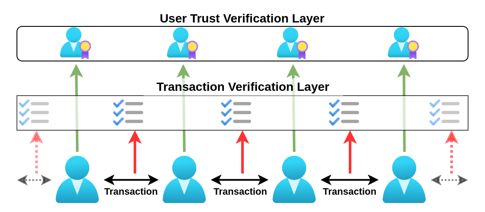

\begin{center}
\vspace{1cm}
\textbf{Supporters \& Contributors} \\
Alexander Mok, David, Johannes Bächlein, Udo Felix Wierlemann \\[0.5cm]

\textbf{License:} \\  
Creative Commons CC0 – No Copyright (Public Domain) \\[0.5cm]

\textbf{Publication:} \\  
Open Access (freely accessible and free of charge) \\[0.5cm]
The concept paper is available on GitHub:  
\url{https://github.com/minutogit/decentralized-voucher-payment-system}
\end{center}

---

## Summary
This concept paper presents a decentralized, trust-based electronic voucher payment system that operates without a traditional globally distributed blockchain and is based on the creation of digital vouchers. These vouchers represent real values such as labor time, raw materials, or existing currencies, enabling stable, speculation-free value transfer. Unlike conventional cryptocurrencies, the system additionally relies on human trust, offering high value stability and prioritizing real economic exchange.

Digital vouchers are created and circulated in a decentralized manner, with their acceptance being strongest in the region of their respective issuer. They can be flexibly adapted to the needs of communities, serving as regional currencies, inflation-protected alternatives, or tools for promoting local economic cycles. An additional security layer with optional servers ensures fraud protection through anonymous transaction data matching.

The system fosters social dynamics, sustainable behavior, and economic stability by incentivizing responsible actions and reputation building. It offers unique features such as speculation-free usage, minimal transaction costs in trusted networks, and the ability to function both online and offline. Overall, the proposed concept represents an innovative solution for regional and global electronic payment systems, integrating human trust, transparency, and flexibility.

## Introduction
Traditional cryptocurrencies like Bitcoin are based on a limited supply of payment units (coins/tokens), whose value is determined solely by supply and demand. Since they are not directly tied to real-world values or economic services, they often experience significant price fluctuations. This volatility results in their frequent use as speculative assets rather than as practical payment methods for economic exchange.

For a viable currency that enables economic calculations and serves as a reliable means of payment, value stability is crucial. The proposed system addresses this issue by introducing digital vouchers directly linked to stable-value resources such as labor time, raw materials, or existing currencies. Since these values offer little potential for speculative profits, speculation becomes unattractive, and the vouchers serve as a reliable medium of exchange for real economic services.

The idea presented here originated from the motivation to transform Minuto-Cash (a decentralized, cash-like payment system [1][2]) into an electronic version that remains as close as possible to the original Minuto-Cash concept. In the original concept, individuals create vouchers secured by guarantors, which are backed by a time-defined labor commitment from the voucher issuer.

This paper introduces an electronic voucher system based on that idea, enabling individuals to generate vouchers in a decentralized manner. These vouchers can, in principle, be backed by various values such as labor, gold, silver, or fiat currencies, depending on what people deem meaningful and useful. Similar to a bank transfer, these vouchers can be transacted and used as a means of payment.

Additionally, the paper explores ideas and approaches for expanding the system beyond local usage. It discusses the unique characteristics, use cases, and challenges associated with implementing such a system.

The main challenges of a decentralized payment system include ensuring trust and fraud resistance without a central authority, balancing transparency with privacy, and scaling for larger networks. This concept addresses these issues through a combination of social trust, decentralized control, and optional security mechanisms. The solutions to these challenges will be examined in more detail in the following sections.

### Functionality – Basic Concept

Unlike traditional cryptocurrencies, which use a globally distributed ledger like a blockchain for transactions, this system is based on decentralized vouchers. These vouchers, which are essentially text files, contain information about the creator, the value, guarantees, and other relevant data. A unique feature of these vouchers is a concatenated list (a kind of mini-blockchain per voucher) that documents the rightful holder and records the transaction history.

Instead of anonymous or pseudonymous addresses, as seen in many cryptocurrencies, **publicly known user IDs** of participants are stored in the transaction history. This transparency allows each transaction to be attributed to a real, trustworthy identity. At the same time, participant privacy is preserved, as transaction details are only accessible to those involved within the transaction chain.

\begin{figure}[h]
    \centering
    \includegraphics[width=0.7\textwidth]{images/voucher transaction circle.drawio.png}
    \caption{Transaction history of a voucher file across multiple users}
\end{figure}

With each transaction, the new holdership is recorded in the voucher file’s transaction list by the current owner using a digital signature. This updated file is then transferred to the new holder—either online (e.g., via email or messenger) or offline (e.g., via a storage device or directly from smartphone to smartphone). This ensures that the holdership history remains decentralized and traceable without requiring a global ledger.

### The Double-Spending Problem

How can we prevent a fraudster from removing a transaction from a voucher file and reusing the same transaction?

Since the system deliberately operates without a global ledger (e.g., blockchain), this challenge is addressed in an innovative way: every transaction must be confirmed by the current voucher holder using a digital signature. If a participant attempts to spend the same voucher multiple times, their signature provides undeniable proof of fraud.

The likelihood of fraud being detected increases over time, as the relevant information spreads through subsequent transactions in the network. In most cases, closed transaction paths form, as vouchers are most widely accepted near their issuer and return to them for redemption. At the latest, a fraudulent duplicate voucher will be exposed upon redemption.

\begin{figure}[h]
    \centering
    \includegraphics[width=0.7\textwidth]{images/voucher double_spending.drawio.png}
    \caption{Once transaction 7 is received, transaction 3 can be identified as fraudulent, and the fraudster can be exposed through their signature.}
\end{figure}

A crucial mechanism of the system is social control. Fraud typically results in **exclusion from the community**, which is a particularly severe penalty since participants not only lose their good reputation but also access to vital networks. This makes fraud an extremely risky and self-damaging action, making it highly unattractive. As a result, the solution is not solely based on ‘cold’ technical measures but is complemented by a ‘warm’ social and human component. This creates new dynamics and properties that particularly promote human cooperation and responsibility.

In small groups based on mutual trust, this system can function without extensive infrastructure. A simple software solution that creates, manages, and detects double-spending of vouchers is sufficient. How fraud cases are handled is up to each group and can be adapted to the needs of the community.

### Transaction Verification Layer

As the number of participants grows or when people do not fully trust each other, it becomes important to ensure that fraud does not occur or that it is detected more quickly. Servers can be used to collect information for detecting double-spending. It is sufficient to gather only anonymous data, such as hashes, to identify duplicate transactions while preserving user privacy.

This security layer can also be made mandatory if desired by users. In such cases, all transactions should be anonymously matched on servers to prevent double-spending. This would eliminate the need to rely on user IDs in the transaction list. Instead, it would only be necessary to trust the voucher issuer to honor the redemption of their vouchers.

### User Trust Verification Layer

The reputation of a user ID becomes increasingly important in such a system over time, as it forms the basis for the trustworthiness of transactions. 

In practice, decentralized systems are needed to manage participants' public keys (IDs) as well as their mutual signatures. 

Participants can establish trust by signing each other's user IDs, proving their credibility within the network. A positive reputation becomes a valuable asset, making it easier for participants to interact with others. Over time, user IDs can become so trusted that they are accepted even in supra-regional networks.

Additionally, market-driven mechanisms such as insurance could emerge to secure user IDs. Such insurance providers could cover losses in case of fraud, offering additional security for all involved parties. Insurers would have an incentive to only back IDs with solid reputations, further strengthening trust in the network. This dynamic could develop organically, making the system more attractive for larger networks and supra-regional applications.

In small groups where participants know each other well, trust verification can be directly managed by the software itself without requiring additional server infrastructure. Only as the system scales do servers become necessary. Servers that already handle transaction verification to detect double-spending could also take on this task.

### Interaction Between Security Layers

The two security layers—transaction verification and trust verification—operate in a dynamic interplay, allowing flexible combinations to maximize security and efficiency depending on the context. The higher the trust among participants in a network, the less frequently transactions need to be verified in real time on servers. Instead, each user’s software can independently detect and prove fraud in a decentralized, delayed manner. In groups with an established reputation, many transactions can proceed without immediate verification, reducing costs and resource consumption. 

For global transactions, where trust between participants is often lower, real-time verification through servers will be required more frequently. However, a strong global reputation could also reduce the need for frequent verifications, increasing system efficiency. Insurance mechanisms could serve as an alternative to immediate verification by covering fraud cases discovered later, thereby transferring risk from individual participants to insurers. 

It is likely that a balance will emerge between real-time verifications and insurance mechanisms, where cost determines which approach is more viable in a given context. Since the system does not rely on a central database, it remains theoretically highly scalable. However, larger networks may require increased usage of optional server verification. A potential solution could be a distributed architecture where multiple independent servers operate in parallel.

### Data Privacy

Access to transactions in this system is tied to the holdership of the respective vouchers. This means that a user can only view the transaction history of a voucher if they have received it themselves or participated in a transaction involving it. For outsiders who do not have access to the voucher, all transactions remain completely hidden.

Thus, transactions in this system are partially public. Only vouchers that a user directly holds allow them to trace the transactions between participants and the exchanged values. The transaction data of the vast majority of vouchers used worldwide remains inaccessible to outsiders.

For vouchers that a user has access to, it is possible to see when a transaction occurred and which participants were involved. However, since each transaction can involve multiple vouchers, the actual total amount of the transaction remains unclear to an observer of a single voucher.

Additionally, sensitive data such as the purpose of the transaction or other details can be transmitted separately from the voucher's transaction data. This ensures that such information remains private and does not need to be stored within the voucher itself. As a result, transparency is maintained where necessary while also protecting user privacy.

### Preventing Excessive Creation of Unbacked Vouchers

In addition to privacy protection, ensuring that vouchers are properly backed is a key factor in maintaining trust in the system. 

To prevent users from issuing an excessive number of vouchers that they may not be able to redeem, a simple decentralized regulation mechanism is used. In Minuto-Cash, for example, the rule is applied that a valid voucher requires two guarantors—one male and one female. These guarantors are responsible for covering the value of the voucher in case the issuer fails to fulfill their commitment.

Since people are unlikely to act as guarantors carelessly—especially when there is a risk that they may have to provide services themselves if the issuer defaults—the creation of vouchers is automatically limited to a reasonable level. Guarantors have a natural incentive to minimize liabilities and will therefore only vouch for trustworthy individuals who can fulfill their obligations.

This mechanism can also be easily implemented digitally. Vouchers can be supplemented with additional digital signatures from guarantors, confirming their responsibility. In the event of non-redemption, guarantors must cover the voucher by providing an equivalent service. This method enables a transparent and efficient regulation of voucher issuance in a decentralized system.

Another important aspect of voucher regulation is limited validity periods. This ensures that vouchers must be redeemed within a certain timeframe and do not remain in circulation indefinitely. This guarantees that the issuer regularly fulfills their obligations. At the same time, it prevents lost or forgotten vouchers from persisting as outstanding debts against the issuer, even when they realistically can no longer be claimed. This way, the issuer always has a clear overview of their actual outstanding obligations.

Ultimately, the market itself will regulate how many vouchers are created and which ones earn trust. It will also dynamically determine in which cases guarantors are necessary and in which networks a high level of trust is sufficient to accept vouchers without additional guarantees. In some cases, further security mechanisms may emerge, such as alternative trust verification methods or insurance systems. 

This flexibility allows the system to adapt to different use cases and levels of trust among participants, ensuring a natural balance between security, trust, and practical usability.

## Technical Implementation

In practice, a voucher is simply a text file. To ensure interoperability, a standardized format must be defined. Below is a rough outline of such a structure.

Each voucher has an issuer, uniquely identified by the `creator_id` (their public key). The file also contains a timestamp, a description of the voucher, the number of payment units, and additional data that may be added in practical implementations. The `voucher_id` is generated as a hash of these details (e.g., encoded in base58). To ensure the authenticity of the voucher, the `voucher_id` is digitally signed by the issuer (`creator_signature`).

\begin{figure}[h]
    \centering
    \includegraphics[width=\textwidth, height=\textheight, keepaspectratio]{images/voucher transaction.png}
    \caption{Example of a voucher with transaction history}
\end{figure}

When a voucher is transferred to another party, transaction data is appended to the voucher file. Each transaction includes a `previous_hash`, which links it to the preceding transaction, and a `transaction_id`, which is derived from the hash of the entire transaction data. The transaction data typically includes the sender, recipient, timestamp, transferred amount, and any other relevant information.

For the first transaction, the `previous_hash` is computed from the hash of the `voucher_id`, while for subsequent transactions, it is derived from the `transaction_id` of the preceding transaction. Each transaction must be digitally signed by the sender to ensure the integrity of the transaction chain.

A voucher can also be split into smaller amounts, allowing precise payments. If a sender transfers only a portion of a voucher, the remaining balance stays with the sender. The sender can later create additional transactions from the last partial transaction as long as there are sufficient funds remaining.

Double-spending can be easily detected by checking whether multiple transactions from the same sender share the same `previous_hash`. Since each transaction is digitally signed, it is also possible to prove exactly who committed the double-spending attempt. In practice, the software must retain expired vouchers over a certain period to allow later detection of double-spending attempts.

\begin{figure}[h]
    \centering
    \includegraphics[width=0.65\textwidth, height=\textheight, keepaspectratio]{images/voucher additional signature.png}
    \caption{Example of an additional signature}
\end{figure}

Additional signatures can be easily integrated into the voucher file. For example, guarantors could sign the `voucher_id` after its creation, confirming their commitment to cover the voucher in case the issuer defaults.

Additionally, it is advisable to integrate a public-key mechanism that supports a Diffie-Hellman key exchange. This allows transaction files to be encrypted during transfer, ensuring that only the intended recipient can decrypt them. This mechanism guarantees that transaction contents remain protected even when sent over insecure channels like email or messaging apps.

## Characteristics and Impact of the System

The system offers numerous features that distinguish it significantly from traditional payment methods and cryptocurrencies, making it an innovative alternative.

- **No speculation incentives**: Since vouchers have a fixed value and are directly backed by services or assets, speculation is effectively prevented.
- **Focus on real value exchange**: The system is primarily designed for value creation exchange between participants, thereby promoting genuine economic activities.
- **Growing trust through network effects**: The larger the network, the greater the incentive to act trustworthily and cooperatively, as positive interactions strengthen reputation and improve access to further networks and opportunities. In contrast, breaches of trust are sanctioned by the community.
- **Trust as a security foundation**: The system relies on a human security layer, reinforced through mutual trust.
- **Low incentives for fraud and theft**: The system’s structure minimizes motivation for illegal activities, as transactions are transparent and clearly linked to participant identities.
- **Encouragement of social behavior**: Participants are motivated to act socially and responsibly, as their reputation directly influences their costs and opportunities within the system.
- **No transaction costs in trusted networks**: In trusted environments where IDs are considered reliable, no additional server verification is required, as even client software can detect fraud over time.
- **Offline functionality**: The system supports offline transactions, making it particularly attractive for regions without stable internet access. It also enables unlimited simultaneous transactions since a global blockchain is not required.
- **Ideal for private networks**: Organizations, initiatives, or communities that want to maintain confidential internal structures will find a suitable solution here. Each group operates as an independent microcosm, leaving no trace in global systems. This guarantees participants maximum privacy and full autonomy.

## Comparison with Blockchain-Based Cryptocurrencies

Since this system is a digital payment method, it is useful to compare it with well-known blockchain-based cryptocurrencies. The system presented here differs fundamentally in its properties and offers some remarkable advantages, particularly due to its social component.

### Unique Features Compared to Cryptocurrencies

#### Freely and Decentrally Created Currency

While cryptocurrency coins or tokens must either be mined through costly energy consumption or purchased with money, vouchers in this system can be freely created by any individual without technical or financial barriers. This makes the currency immediately available and directly contributes to value creation and economic exchange.

#### No Dependence on Scarcity

Many cryptocurrencies, such as Bitcoin, rely on artificial scarcity enforced by technical limitations like a maximum token supply, which can lead to unequal distribution. Wealthy entities can accumulate large amounts, while economically disadvantaged individuals may be restricted from accessing the necessary currency. The voucher system avoids this issue by directly linking value to real services or resources, allowing vouchers to be issued as needed.

#### Regional Currency Characteristics

Due to the decentralized nature of the system, vouchers often remain within the vicinity of their creator. This supports regional economic cycles, strengthens local businesses, and provides a direct benefit to the community. At the same time, if a strong global reputation system is established, the vouchers can be used flexibly across regional borders. In contrast, cryptocurrencies often lack a local connection and frequently flow into global speculative markets.

#### Social Control Instead of Technical Consensus Mechanisms

The voucher system utilizes social dynamics, reputation, and trust networks to secure transactions. These mechanisms encourage direct accountability and reduce reliance on technical verification. Cryptocurrencies, on the other hand, depend on energy-intensive technical consensus mechanisms like Proof-of-Work or Proof-of-Stake, which operate independently of social behavior.

#### Free from Speculation

Unlike cryptocurrencies, whose values often experience high volatility, the vouchers in this system are speculation-free. They represent real-world values such as labor or raw materials, making them stable and predictable.

### Table – Comparison with Cryptocurrencies

To further highlight the differences between the voucher system and blockchain-based cryptocurrencies, the following table provides a direct comparison of key attributes.

\begin{longtable}{|>{\raggedright\arraybackslash}p{4cm}|>{\raggedright\arraybackslash}p{5.7cm}|>{\raggedright\arraybackslash}p{5.7cm}|}
\hline
\rowcolor[gray]{0.9} \textbf{Attribute} & \textbf{Voucher System} & \textbf{Blockchain System} \\
\hline
\renewcommand{\arraystretch}{1.5}
Organization & Decentralized, without a global ledger. & Decentralized but reliant on a globally distributed ledger (blockchain). \\
\hline
Scalability & High scalability, as transactions can be verified and stored locally. & Limited scalability, as all transactions must be recorded on a global ledger. \\
\hline
Energy Consumption & Minimal, since no consensus mechanisms like Proof-of-Work are required. & High, especially for mining-based blockchains like Bitcoin. \\
\hline
Transaction Speed & Fast, as no global validation is required. & Can be slow, especially on heavily used networks (e.g., Bitcoin, Ethereum). \\
\hline
User Transaction Costs & Low to zero in trusted networks. & Variable, often high due to network fees (e.g., gas fees on Ethereum). \\
\hline
Offline Functionality & Supported, as transactions can be stored and transferred locally or offline. & Not possible, as a connection to the blockchain is required. \\
\hline
Double-Spending Protection / Fraud Prevention & Digital signatures and social control. Fraud is detectable and leads to reputation loss. & Consensus mechanisms (e.g., Proof-of-Work, Proof-of-Stake). \\
\hline
Hacking/Theft Incentive & Low: Identity binding and social control minimize incentives. & High: Large assets and pseudonymity attract hackers. \\
\hline
Use in Illegal Transactions & Low: Social control and partly-public transactions make illicit use difficult. & High: Anonymity and global reach facilitate illicit use (e.g., on the darknet). \\
\hline
Privacy & Partly-public: Only direct access to vouchers reveals transaction details. & Pseudonymous, but all transactions are publicly viewable (e.g., Bitcoin blockchain). \\
\hline
Anonymity & Anonymized through hashes and partly-public transactions. & Pseudonymous, but addresses can often be traced back. \\
\hline
Backing Flexibility & Vouchers can be backed by labor, raw materials, fiat currencies, or other assets. & Coins/tokens are usually based on scarcity or speculative market mechanisms. \\
\hline
Speculation & Speculation-free, as the value is tied to real services or assets. & Highly speculative, as value is often determined purely by supply and demand. \\
\hline
Reputation and Trust & Trust is based on social control, reputation mechanisms, and optional guarantors. & No direct trust required, as security is enforced through consensus mechanisms. \\
\hline
Use Cases & Regional currencies, time banks, commodity-backed currencies, local communities. Also viable for global use with reputation-based networks. & Primarily used for global trade, speculation, and digital assets. \\
\hline
\end{longtable}

## Use Cases

The system provides the flexibility to represent almost any currency or resource in parallel and be applied in a variety of scenarios. It can be used both as a local regional currency and for processing global transactions or supporting sustainable initiatives. Different types of value, such as labor, raw materials, services, or traditional currencies, can be integrated simultaneously. The following examples illustrate the versatility and adaptability of the voucher system across various applications.

### Regional Currencies Based on National Currencies
Local and regional groups could issue vouchers backed directly by their national currency (e.g., Euro or Dollar). Participants deposit money and issue vouchers of equivalent value, which circulate within the region. This keeps money local, strengthens the regional economy, and promotes community exchange.

### Value-Stable Vouchers Backed by Precious Metals
In times of economic instability, individuals could issue vouchers backed by valuable assets such as silver. These vouchers would provide an inflation-proof alternative to unstable currencies and allow transactions in flexible amounts without relying on physical silver coins.

### Time Banks and Barter Networks
Vouchers could represent work hours and be used in time banks or local barter exchanges. This would encourage the exchange of services, strengthen social networks, and help build mutual trust within communities.

### Community Projects and Crowdfunding
Vouchers could be used to fund community projects or crowdfunding campaigns. Participants receive vouchers in return, which they can later redeem for the project's services or benefits, fostering community engagement and making projects more financially viable.

### Commodity and Energy Trading
Vouchers could serve as units of energy (e.g., kWh) or raw materials (e.g., grain, water). This would simplify trade and improve planning in relevant markets, especially in sustainable resource management.

### Event-Based Currencies
Temporary voucher systems could be introduced for festivals, trade fairs, or events. These would simplify on-site transactions, protect participants' privacy, and create a closed economic ecosystem.

### Education and Training Vouchers
Institutions could issue vouchers for access to courses, seminars, or other educational offerings. This would facilitate access to education, create incentives for further learning, and increase the reach of such programs.

### Crisis Relief and Humanitarian Aid
In crisis regions, vouchers could serve as an alternative payment method to promote trade and exchange. Even without functioning official currencies, local resources could be mobilized to support communities.

### Internal Corporate Systems
Companies could use vouchers for employee benefits or internal service exchanges between departments. This would simplify internal processes, motivate employees, and establish a clear structure for rewards or resource allocation.

### Recycling and Sustainability Programs
Vouchers could be issued for returning recyclable materials and redeemed for sustainable products or services. This would encourage recycling, reduce waste, and create additional incentives for environmentally friendly behavior.

### Urban Development and Infrastructure
Cities could use vouchers to reward citizens for volunteer work or support infrastructure projects. These vouchers could be redeemed locally, contributing to an improved quality of life.

### Digital Nomads and Freelancers
Global networks could use vouchers for payments in cross-border work relationships. This would provide digital security, encourage cultural exchange, and simplify payments within globally connected communities.

## Perspectives for Further Development and Establishment

The proposed system is fully decentralized and provides users with the ability to self-organize and develop solutions to emerging challenges. Tax or legal issues that may be relevant to individual users must be clarified independently by them. However, in small, private applications, such aspects are often less critical, and solutions can be freely tested in such environments.

With widespread global adoption, there may be a need for advanced security layers, particularly to enable transactions to be efficiently and decentrally verified. Mechanisms could emerge that detect double-spending quickly without compromising user privacy. Similarly, the issue of the trustworthiness of user IDs remains open: how trust is built in global networks and how fraud cases are handled are questions that should be allowed to develop organically in response to user needs.

Interoperability with existing payment systems and other technologies will also evolve according to user demand. If a need arises to integrate with established systems like banks or cryptocurrencies, hybrid approaches could be developed to combine the advantages of different systems.

Users can conduct test scenarios for practical applications of the system at any time in small, private environments, provided that suitable software and applications are available. This allows for gradual testing of the system, identification of weaknesses, and the development of solutions in a controlled setting. An initial implementation of this concept already exists in the form of a desktop prototype called eMinuto [3][4], which demonstrates the functionality of the voucher system.

The standardization of voucher formats and other technical details will also be a natural process that evolves over time. In a decentralized environment, standards will emerge through user consensus and the practical viability of solutions. This enables a flexible and adaptable development path driven by user needs and innovation.

Ultimately, the future of the system will be determined by its users. They decide how the system is used, which mechanisms become established, and how significant its global impact will be. Decentralized payment systems can enhance societal resilience against crises and foster prosperity, particularly in regions where centralized systems fail due to a lack of creditworthiness or other barriers. This potential makes the proposed solution a promising foundation for a more equitable, sustainable, and robust global economy.

## Conclusion

The proposed decentralized voucher payment system combines unique features with the potential to serve as an innovative alternative to traditional payment methods and blockchain-based cryptocurrencies. It enables the representation of real values such as labor time, raw materials, or existing currencies and provides a foundation for stable, speculation-free value transfer. The focus on social dynamics, reputation, and trust particularly distinguishes the system, as it operates without energy-intensive technical consensus mechanisms.

The system promotes sustainable economic cycles by strengthening local and regional communities while also being applicable on a broader scale once global reputation mechanisms are developed. The flexible integration of resources allows for diverse use cases, ranging from regional currencies and educational or crowdfunding projects to recycling programs.

A significant advantage is the ability to transfer partial voucher amounts precisely and process transactions offline, making it particularly attractive for regions with weak infrastructure. As adoption increases, mechanisms for global trust-building—such as insurance or standardized reputation systems—could emerge, facilitating its use on an international scale.

The next steps involve developing a standardized data format for vouchers to ensure compatibility between different programs and facilitate exchange between networks. Equally important is the provision of user-friendly software to make system access and application intuitive and efficient. Overall, the system represents a future-proof, sustainable solution that redefines trust, flexibility, and security in electronic payment systems.

### References 
[1] \url{https://minutocash.org}  
[2] \url{https://www.minuto.wiki}  
[3] \url{https://eminuto.org}  
[4] \url{https://github.com/minutogit/MinutoCashDigitalPrototype}  
